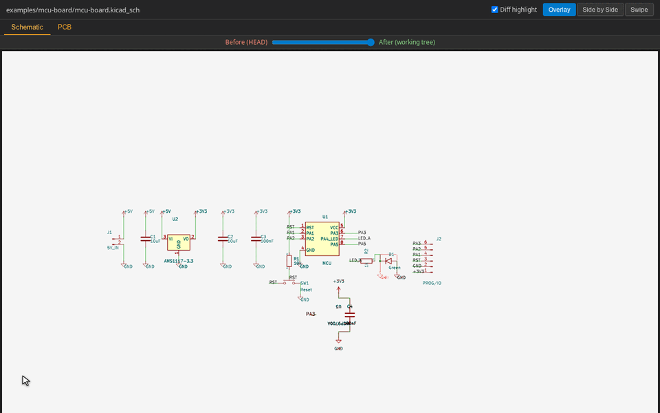

# kicadiff

Visual diff tool for KiCad projects — see what changed between two
states of a `.kicad_pcb` / `.kicad_sch` / `.kicad_sym` / `.kicad_mod`
file in your browser, or as a markdown report you can paste into a PR.

[日本語版 README](./README.ja.md)



## What you get

- **HTML viewer** with side-by-side / overlay / swipe modes, layer toggles
  for PCBs, page navigation for hierarchical schematics, wheel-to-zoom and
  right-click-drag-to-pan, and an amber tab marker on files / pages whose
  rendered output actually changed.
- **Markdown report** (`--md`) with side-by-side image tables and a
  structural component diff (added / removed / changed by reference
  designator). Good for PR descriptions and commit messages.
- **Text-only structural diff** (`--text-only`) — fast, no image
  rendering, prints to stdout.

## Requirements

- [`kicad-cli`](https://www.kicad.org/) 9.x or later (rendering engine).
- [Bun](https://bun.sh) — runs the TypeScript CLI directly via shebang.
  Bun also compiles the standalone binary, so no separate Node install
  is needed for any workflow. Standalone binary users skip this.

The render pipeline (SVG → PNG, tri-colour pixel diff highlight) used to
need `rsvg-convert` and ImageMagick; both are now in-process
(`@resvg/resvg-js` for rasterisation, a small custom classifier on top
of `pngjs` for the diff overlay).

## Install

Three ways depending on what's already on your machine:

```sh
# 1. One-shot via Bun's package runner (no install)
bunx kicadiff [args...]

# 2. Global install (puts `kicadiff` on PATH)
pnpm add -g kicadiff
# or with `bun add -g kicadiff` / `npm install -g kicadiff`

# 3. Standalone binary — single file, no Bun runtime needed.
#    Drops `kicadiff` into ~/.local/bin (override with KICADIFF_INSTALL_DIR).
curl -fsSL https://raw.githubusercontent.com/sksat/kicadiff/main/install.sh | sh
```

`kicad-cli` (and `rsvg-convert` / `magick`) are not bundled — install KiCad 9+
first, then pick whichever kicadiff distribution form fits your workflow.

## Usage

`kicadiff` works on the same positional argument shape as `git diff`,
plus a few subcommands when you want to scope to one file type.

```sh
# Project-level diff (cwd, both PCB and schematic, default = HEAD vs working tree)
kicadiff

# Pass a project root, a .kicad_pro, or any single KiCad file
kicadiff path/to/project/
kicadiff project.kicad_pro
kicadiff project.kicad_pcb

# Compare arbitrary refs
kicadiff main path/to/project/         # working tree vs main
kicadiff v1.0 v2.0 board.kicad_pcb     # v1.0 vs v2.0
kicadiff main..feat foo.kicad_pcb      # range syntax
kicadiff main -- foo.kicad_pcb         # explicit `--` separator

# Subcommands scope to one file type (skip sibling auto-detect)
kicadiff pcb foo.kicad_pcb
kicadiff sch foo.kicad_sch       # alias: schematic
kicadiff sym lib.kicad_sym       # alias: symbol
kicadiff fp foo.kicad_mod        # alias: footprint
kicadiff fp lib.pretty           # whole .pretty/ library

# Output formats
kicadiff project/                       # default: HTML viewer + images
kicadiff project/ --md                  # markdown report + images, no HTML
kicadiff project/ --md --output report.md
kicadiff project/ --md --output -       # markdown to stdout, logs to stderr
kicadiff project/ --text                # also print structural text diff
kicadiff project/ --text-only           # text only, skip rendering (fast)
kicadiff project/ --images-only         # PNGs only, no HTML / markdown

# Custom markdown templates (Mustache subset: {{var}}, {{#section}}…{{/section}},
# {{^inverted}}…{{/inverted}}). Project template sees from_label / to_label /
# file_count / has_changes / files / file_sections. File template sees path /
# type / before_image / after_image / has_both / after_only / before_only /
# added_count / removed_count / changed_count / unchanged_count /
# has_structural_diff (real component changes) / has_visual_diff (PNGs differ) /
# has_changes (any of the above) / structural_diff (formatted body). Either
# flag is optional; the default template ships built-in.
kicadiff project/ --md --md-template my-report.md.tpl
kicadiff project/ --md --md-file-template my-file.md.tpl

# Auto-open the HTML in VSCode (Live Preview), a browser, etc.
kicadiff project/ --open vscode
kicadiff project/ --open firefox
kicadiff project/ --open=/usr/bin/open  # arbitrary command

# Watch mode — re-render every time an input file changes. Hot reload comes
# from the viewer: VSCode Live Preview / live-server / similar will refresh
# the page automatically once kicadiff overwrites the images. For plain
# file:// browsers, kicadiff injects a tiny image-polling script so the
# rendered images update in place without needing F5.
kicadiff project/ --watch
kicadiff project/ --watch --open vscode

# Other
kicadiff project/ -v                    # verbose summary (full PNG paths)
kicadiff project/ -q                    # suppress summary
kicadiff project/ --no-cache            # bypass the render cache

# Claude Code PostToolUse hook integration. Reads the hook JSON from
# stdin, renders only when the edited file is .kicad_pcb / .kicad_sch.
# Default: --open vscode (override with --open <target> as usual).
kicadiff hook
```

## Output

By default kicadiff writes to `<repo>/.claude/preview/` (next to the git
root) so the directory is easy to find from the project. Override with
`--output-dir <dir>` for the image directory, and `--output <path>` to
relocate the HTML / markdown file specifically (image paths in the
file get rewritten to be relative to it, so the file stays portable).

The HTML viewer is a single file with the manifest + image references
inline; you can email it, host it as a static asset, or open it
locally with VSCode's Live Preview extension.

## Render cache

Every per-side render is content-addressed and cached under
`$XDG_CACHE_HOME/kicadiff` (or `~/.cache/kicadiff`). Repeat runs
against unchanged content return in ~1 s vs ~5 s cold. Bypass with
`--no-cache` or override the location with `KICADIFF_CACHE_DIR`.

## GitHub Actions

Drop the action into a workflow to render a visual diff for every PR
that touches a KiCad file. The action handles KiCad install, runs
kicadiff, and (opt-in) uploads the rendered images as a build artifact,
writes a job summary with inline before/after images, upserts a sticky
PR comment, and updates a marked section in the PR description.

```yaml
# .github/workflows/kicad-diff.yml
name: KiCad visual diff
on:
  pull_request:
    paths: ["**/*.kicad_pcb", "**/*.kicad_sch"]
permissions:
  contents: read
  pull-requests: write   # only needed for pr-comment / pr-description
jobs:
  diff:
    runs-on: ubuntu-latest
    steps:
      - uses: actions/checkout@v6
        with: { fetch-depth: 0 }
      - uses: sksat/kicadiff@v0.1.0
        with:
          path: hardware/main-board   # default: cwd
          upload-artifact: 'true'
          pr-comment:      'true'
          pr-description:  'true'
```

Job summary embeds combined PNGs as base64 data URIs (no extra hosting
needed) up to a 1 MiB cap; if a project's images would overflow, the
action drops the rest, emits `::warning::`, and links to the artifact
for the full set. PR comment / description are kept text-only and link
to the artifact for images.

`install-kicadiff: bunx` (default) pulls the latest published kicadiff
on demand; pin a version with `install-kicadiff: <semver>`. Pre-installed
on PATH? Use `install-kicadiff: skip`.

## More

- `DESIGN.md` — architecture, render pipeline, cache key shape,
  manifest schema, viewer mode semantics
- `examples/blink/` — minimal KiCad project used as the test fixture
  and a usable starting point. Ships with a `.claude/settings.json`
  PostToolUse hook (`kicadiff hook`) that re-renders the diff every
  time a `.kicad_pcb` / `.kicad_sch` is Edited / Written.
- `examples/mcu-board/` — a more realistic small-board layout: an
  8-pin MCU stand-in with the usual stuff around it (5 V → 3.3 V
  AMS1117 LDO, decoupling caps, reset switch with pull-up, status
  LED, and a 6-pin programming/breakout header). Hierarchical
  schematic — root for the power chain and MCU itself,
  `peripherals.kicad_sch` sub-sheet for the reset/LED/header — so
  the per-page tabs in the viewer have something to switch between.
